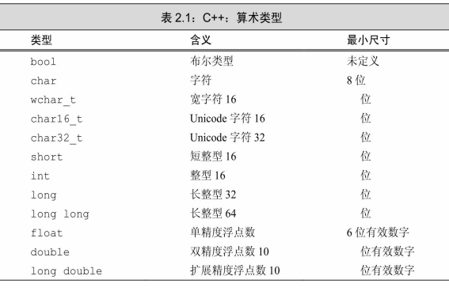
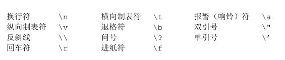
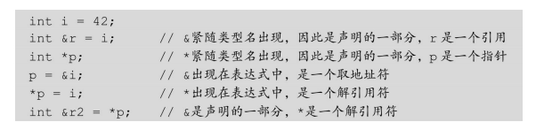

## Chapter 2 变量和基本类型

### 2.1 基本内置类型

C++定义了一套包括算术类型（arithmetic type）和空类型（void） 在内的基本数据类型。其中算术类型包含了字符、整型数、布尔值和浮点数，当函数不返回任何值时使用空类型作为返回类型。

#### 算术类型

算术类型分成两种： **整型(integral type)**和**浮点型** 并且某一类型所占的比特数不同，它所能表示的 数据范围也不一样 



- 基本的字符类型 是char，一个char的空间应确保可以存放机器基本字符集中任意字符对 应的数字值。也就是说，一个char的大小和一个机器字节一样。 

- C++语言规定一个int至少和一个short一样大，一个long至少和一个 int一样大，一个long long至少和一个long一样大。其中，数据类型long long是在C++11中新定义的。 
- 大多数机器的字节由8 比特构成，字则由32或64比特构成，也就是4或8字节。 
- 浮点型可表示单精度、双精度和扩展精度值，通常，float以1个字（32比特）来表示，double以2个字（64比特）来表 示，long double以3或4个字（96或128比特）来表示。 
- 整型可以划分为**带符号的 (signed)**和**无符号的(unsigned)**两种。 类型int、short、long和long long都是带符号的，通过在这些类型名前添加**unsigned**就可以得到无符号类型,带符号类型可以表示正数、 负数或0，无符号类型则仅能表示大于等于0的值。 
- 字符型被分为了三种：char、signed char和 unsigned char。特别需要注意的是：类型char和类型signed char并不一 样。尽管字符型有三种，但是字符的表现形式却只有两种：带符号的和 无符号的。类型char实际上会表现为上述两种形式中的一种，具体是哪 种由编译器决定。 

##### 选择类型

- 当明确知晓数值不可能为负时，选用无符号类型。 
- 使用**int**执行整数运算。在实际应用中，**short**常常显得太小而**long**一般和int有一样 的尺寸。如果你的数值超过了int的表示范围，选用**long long**。 
- 在算术表达式中不要使用char或bool，只有在存放字符或布尔值时才使用它们。 因为类型char在一些机器上是有符号的，而在另一些机器上又是无符号的，所以如果 使用char进行运算特别容易出问题。如果你需要使用一个不大的整数，那么明确指定 它的类型是**signed char**或者**unsigned char**。 
- 执行浮点数运算选用double，这是因为float通常精度不够而且双精度浮点数和单 精度浮点数的计算代价相差无几。事实上，对于某些机器来说，双精度运算甚至比单 精度还快。long double提供的精度在一般情况下是没有必要的，况且它带来的运行时 消耗也不容忽视 

#### 类型转换

- 当我们把一个布尔值赋给非布尔类型时，初始值为false则结果为 0，初始值为true则结果为1。 
- 当我们把一个浮点数赋给整数类型时，进行了近似处理。结果值 将仅保留浮点数中小数点之前的部分。 
- 当我们把一个整数值赋给浮点类型时，小数部分记为0。如果该整 数所占的空间超过了浮点类型的容量，精度可能有损失。 
- 当我们赋给无符号类型一个超出它表示范围的值时，结果是初始 值对无符号类型表示数值总数取模后的余数。例如，8比特大小的 unsigned char可以表示0至255区间内的值，如果我们赋了一个区间以外 的值，则实际的结果是该值对256取模后所得的余数。因此，把-1赋给8 比特大小的unsigned char所得的结果是255。
- 当我们赋给带符号类型一个超出它表示范围的值时，结果是未定 义的（undefined）。此时，程序可能继续工作、可能崩溃，也可能生成 垃圾数据。 
- 当一个算术表达式中**既有无符号数又有int值 时，那个int值就会转换成无符号数**。把int转换成无符号数的过程和把int 直接赋给无符号变量一样

```cpp
#include<iostream>
int main(){
	unsigned u = 10;
	int i = -42;
	std::cout << i + i << std::endl; // output 84
	std::cout << u + i << std::endl; // output 4294967264
	return 0; 
}
```

得出结论：**切勿混用带符号类型和无符号类型** 

-  当从无符号数中减去一个值时，不管这个值是不是无符号数，我们 都必须确保结果**不能是一个负值** 

```cpp
#include<iostream>
int main(){
	unsigned u1 = 42, u2 = 10;
	std::cout << u1 - u2 << std::endl; //Output 32
	std::cout << u2 - u1 << std::endl; //Output 4294967264  after moding value
	return 0; 
}
```

#### 字面值常量(literal)

##### 整型和浮点型字面值

- 我们可以将整型字面值写作十进制数、八进制数或十六进制数的形式，我们可以将整型字面值写作十进制数、八进制数或十六进制数的形式； 以0开头的整数代表八进制数，以0x或0X开头的代表十六进制  
- 尽管整型字面值可以存储在带符号数据类型中，但严格来说，十进 制字面值不会是负数。如果我们使用了一个形如-42的负十进制字面 值，那个负号并不在字面值之内，**它的作用仅仅是对字面值取负值而已**。 
- 浮点型字面值表现为一个小数或以科学计数法表示的指数，其中指 数部分用E或e标识： `3.14159 3.14159E0  0. 0e0 .001`默认的，浮点型字面值是一个double 

##### 字符型字面值

- 由单引号括起来的一个字符称为char型字面值，双引号括起来的零 个或多个字符则构成字符串型字面值。 

```cpp
'a' // 字符字面值
"Hello World!" //字符串字面值
```

- 编译器在每个字符串的结尾处添加 一个空字符（′\0′），因此，字符串字面值的实际长度要比它的内容多 1,如果两个字符串字面值位置紧邻且仅由空格、缩进和换行符分隔， 则它们实际上是一个整体。当书写的字符串字面值比较长，写在一行里 不太合适时，就可以采取分开书写的方式： 

```cpp
// 分多行书写的字符串字面值
std::cout<< "a really, really long string literal"
			"that spans two lines" << std::endl;
```

- 在C++语言中有特殊含义的字符（单引号、双引号、问号、反斜线）。 在这些情况下需要用到转义序列（escape sequence） 转义序列均以反 斜线作为开始，C++语言规定的转义序列包括： 



- 通过添加表中所列的前缀和后缀，可以改变整型、浮点型和 字符型字面值的默认类型。 


##### 布尔字面值和指针字面值 

true和false是布尔类型的字面值： 

```cpp
bool test = false;
```

nullptr是指针字面值

### 2.2 变量

#### 变量定义

变量定义的基本形式是：首先是类型说明符（**type specifier**），随 后紧跟由一个或多个变量名组成的列表，其中变量名以逗号分隔，最后 以分号结束。 

**对象是具有某种数据类型的内存空间** 

**初始化不是赋值，初始化的含义是创建变量时赋予其一个初始值，而赋值的含义 是把对象的当前值擦除，而以一个新值来替代。**  

##### 列表初始化 

- C++11新标准 :用花括号来初始化变量 

```cpp
int units_sold = 0;
int units_sold(0);

//新特性
int units_sold = {0};  
int units_sold{0};
```

当用于内置类型的变量时， 这种初始化形式有一个重要特点：如果 我们使用列表初始化且初始值存在丢失信息的风险，则编译器将报错 

##### 默认初始化 

- 如果是内置类型的变量未被显式初始化，它的值由定义的位置决定。 定义于任何函数体之外的变量被初始化为0 ，一种例外情况是，定义在函数体内部的内置类型变量将不被 初始化（**uninitialized**）
- 一个未被初始化的内置类型变量的值是未定义 的，如果试图拷贝或以其他形式访问此类值将 引发错误。 
- 绝大多数类都支持无须显式初始化而定义对象，这样的类提供了一 个合适的默认值。例如 

```cpp
std::string empty; // empty 非显式的初始化为一个空串
```

- 一些类要求每个对象都显式初始化，此时如果创建了一个该类的对 象而未对其做明确的初始化操作，将引发错误。 

#### 变量声名和定义的关系

为了允许把程序拆分成多个逻辑部分来编写，C++语言支持分离式 编译（separate compilation）机制，该机制允许将程序分割为若干个文 件，每个文件可被独立编译。 

- 为了允许把程序拆分成多个逻辑部分来编写，C++语言支持分离式 编译（separate compilation）机制，该机制允许将程序分割为若干个文 件，每个文件可被独立编译。 
- 变量声明规定了变量的类型和名字，在这一点上定义与之相同。但 是除此之外，定义还申请存储空间，也可能会为变量赋一个初始值。
- 如果想声明一个变量而非定义它，就在变量名前添加关键字 extern，而且不要显式地初始化变量 
- **extern语句如果包含初始值就不再是声明，而变成定义了** 

```cpp
extern int i; // 声名i而非定义i
int j; // 声名并定义j
extern double pi = 3.1416; // 定义
```


##### 关键概念：静态类型 

C++是一种静态类型（**statically typed**）语言，其含义是在编译阶段检查类型。其 中，检查类型的过程称为类型检查（type checking）。 

我们已经知道，对象的类型决定了对象所能参与的运算。在C++语言中，编译器 负责检查数据类型是否支持要执行的运算，如果试图执行类型不支持的运算，编译器 将报错并且不会生成可执行文件。 

程序越复杂，静态类型检查越有助于发现问题。然而，前提是编译器必须知道每 一个实体对象的类型，这就要求我们在使用某个变量之前必须声明其类型。 

#### 标识符

- C++的标识符（**identifier**）由字母、数字和下画线组成，其中必须 以字母或下画线开头，标识符的长度没有限制，但是对大小写字母敏感 
- 用户自定义的标识符中不 能连续出现两个下画线，也不能以下画线紧连大写字母开头。此外，定 义在函数体外的标识符不能以下画线开头。 

##### 变量命名规范

- 标识符要能体现实际含义 
- 变量名一般用小写字母 
- 用户自定义的类名一般以大写字母开头，如Sales_item 
- 如果标识符由多个单词组成，则单词间应有明显区分，如 **student_loan**或**studentLoan**，不要使用studentloan。 


#### 名字的作用域

不论是在程序的什么位置，使用到的每个名字都会指向一个特定的 实体：变量、函数、类型等。然而，同一个名字如果出现在程序的不同 位置，也可能指向的是不同实体 

- 作用域（**scope**）是程序的一部分，在其中名字有其特定的含义。 C++语言中大多数作用域都以花括号分隔 
- 名字main定义于所有花括号之外，它和其他大多数定义在函数体之 外的名字一样拥有全局作用域（**global scope**） 

##### 嵌套的作用域

- 作用域能彼此包含，被包含（或者说被嵌套）的作用域称为内层作 用域**（inner scope）**，包含着别的作用域的作用域称为外层作用域 **（outer scope）** 
- 作用域中一旦声明了某个名字，它所嵌套着的所有作用域中都能访 问该名字。同时，允许在内层作用域中重新定义外层作用域已有的名字 ，并且内层作用域的变量将覆盖掉外层作用域的变量
- 如果函数有可能用到某全局变量，则**不宜再定义一个同名的局部变量** 

### 2.3 复合类型 

- C++语 言有几种复合类型，本章将介绍其中的两种：引用和指针 

- 一条声明语句由 一个基本数据类型（base type）和紧随其后的一个声明符（declarator） 列表组成 

#### 引用

引用（**reference**）为对象起了另外一个名字，引用类型引用（**refers to**）另外一种类型。通过将声明符写成&d的形式来定义引用类型，其中 d是声明的变量名  

- 定义引用时，程序把引用和它的初始值绑定（**bind**）在一起，而不是将初始值拷贝给引用。 

##### 引用即别名

- 引用并非对象，相反的，它只是为一个已经存在的对象所起的另外一个名字。
- **引用只能被引用一次，并且中途无法更改** 
- 获取引用的值，实际上是获取了与引用绑定的对象的值 
- 因为引用本身不是一个对象，所以不能定义引用的引用 

##### 引用的定义

- 引用只能绑定在对象上，而不能与字面值或某个表达式的计算结果绑定在 一起 

```cpp
int &refVal4 = 10;				// 错误： 引用类型的初始必须是一个对象，而不是一个字面值
double dval = 3.14;
int &refVal5 = dval; 			// 错误： 引用类型的初始值必须是int 型对象
```

#### 指针

指针（**pointer**）是“指向（point to）”另外一种类型的复合类型。与引用类似，指针也实现了对其他对象的间接访问。然而指针与引用相比 又有很多不同点。其一，**指针本身就是一个对象**，允许对指针赋值和拷贝，**而且在指针的生命周期内它可以先后指向几个不同的对象**。其二， 指针无须在定义时赋初值。和其他内置类型一样，在块作用域内定义的 指针如果没有被初始化，也将拥有一个不确定的值。

- 定义指针类型的方法将声明符写成`*d`的形式 

##### 获取对象的地址

- 指针存放某个对象的地址，要想获取该地址，需要使用取地址符 （操作符**&**） 

指针值应属于下面四种状态之一：

- 指向一个对象 
- 指向紧邻对象所占空间的下一个位置。 
- 空指针，意味着指针没有指向任何对象。 
- 无效指针，也就是上述情况之外的其他值 

**试图拷贝或以其他方式访问无效指针的值都将引发错误** 

##### 利用指针访问对象

如果指针指向了一个对象，则允许使用解引用符（操作符＊）来访 问该对象 

##### 关键概念：某些符号有多重含义 



##### 空指针

**空指针（null pointer）**不指向任何对象，在试图使用一个指针之前 代码可以首先检查它是否为空，得到空指针最直接的办法就是用字面值**nullptr**来初始化指针，这也 是C++11新标准刚刚引入的一种方法，**nullptr**是一种特殊类型的字面 值，它可以被转换成任意其他的指针类型。另 一种办法就是通过将指针初始化为字面值0来生成空指针。 

过去的程序还会用到一个名为NULL的**预处理变量（preprocessor variable）**来给指针赋值，这个变量在头文件cstdlib中定义，它的值就是 0 。

**在新标准下，现在 的C++程序最好使用nullptr** 

##### 赋值和指针

- 一旦定义了引用，就无法令其再绑定到另外的对象，之后每次使用这个引用都是访问它最初绑定的那个对象 

- 有时候要想搞清楚一条赋值语句到底是改变了指针的值还是改变了 指针所指对象的值不太容易，**最好的办法就是记住赋值永远改变的是等 号左侧的对象** 

##### 其他指针操作

- 如果指针的值 是0，条件取false 
- 对于两个类型相同的合法指针，可以用相等操作符（==）或不相等 操作符（!=）来比较它们，比较的结果是布尔类型。如果两个指针存 放的地址值相同，则它们相等 
- 一个指针 指向某对象，同时另一个指针指向另外对象的下一地址，此时也有可能 出现这两个指针值相同的情况，即指针相等 

##### void＊ 指针 

**void＊**是一种特殊的指针类型，可用于存放任意对象的地址。一个 **void＊**指针存放着一个地址，这一点和其他指针类似。不同的是，我们 对该地址中到底是个什么类型的对象并不了解 。

#### 理解复合类型的声明

在同一条定义语句中，虽然基本数据类型只有一个，但是声明 符的形式却可以不同

#####  指向指针的指针 

一般来说，声明符中修饰符的个数并没有限制,允许把指针的地址再 存放到另一个指针当中 

```cpp
int ival = 1024;
int *pi = &ival;
int **ppi = &pi;
```

此处pi是指向int型数的指针，而ppi是指向int型指针的指针 


### 2.4 const限定符

满足随时警惕防止程序 一不小心改变了这个值这一要求，可以用关键字const对变量的类型加以限定。

因为const对象一旦创建后其值就不能再改变，**所以const对象必须 初始化** 

##### 初始化和const

与非const类 型所能参与的操作相比，const类型的对象能完成其中大部分，但也不是 所有的操作都适合。主要的限制就是只能在const类型的对象上执行不改 变其内容的操作 

##### 默认状态下，const对象仅在文件内有效 

我们希望只在一个文件中定义const，而在其他多 个文件中声明并使用它的时候我们可以对于const变量不管是声明还是定义都添加extern关 键字，这样只需定义一次就可以了 

#### const的引用

可以把引用绑定到const对象上，就像绑定到其他对象上一样，我们 称之为对常量的引用（reference to const）。与普通引用不同的是，对 常量的引用不能被用作修改它所绑定的对象

##### 初始化和对const的引用 

引用的类型必须与其所引用对象的类型一 致，但是有两个例外。第一种例外情况就是在初始化常量引用时允许用 任意表达式作为初始值，只要该表达式的结果能转换成引用的类型即可。 

```cpp
double dval = 3.14;
const int &ri = dval;
```

此处`ri `引用了一个`int`类型的整数，但dval却 是一个双精度浮点数而非整数。因此为了确保让ri绑定一个整数，编译 器把上述代码变成了如下形式： 

```cpp
const int temp = dval;
const int &ri = temp;
```

在这种情况下，ri绑定了一个临时量**（temporary）**对象 

##### 对const的引用可能引用一个并非const的对象 

常量引用仅对引用可参与的操作做出了限定，对于引 用的对象本身是不是一个常量未作限定。因为对象也可能是个非常量， 所以允许通过其他途径改变它的值： 

```cpp
int i = 42;
int &r1 = i;
const int &r2 = i;
r1 = 0;
r2 = 0;
```

r2绑定（非常量）整数i是合法的行为。然而，不允许通过r2修改i 的值 

#### 指针和const

- 指向常量的指针**（pointer to const）**不能用 于改变其所指对象的值。要想存放常量对象的地址，只能使用指向常量的指针 。
- 指针的类型必须与其所指对象的类型一 致，但是有例外：允许令一个指向常量的指针指 向一个非常量对象 即指向常量的指针也没有规定其所指的对象必须是一个常量 

##### const 指针

常量指针（**const pointer**）必须初始化，而且一旦初始 化完成，则它的值（也就是存放在指针中的那个地址）就不能再改变 了。把`＊`放在const关键字之前用以说明指针是一个常量，这样的书写形 式隐含着一层意味，**即不变的是指针本身的值而非指向的那个值** 

指针本身是一个常量并不意味着不能通过指针修改其所指对象的 值，能否这样做完全依赖于所指对象的类型。

#### 顶层const

指针本身是一个对象，它又可以指向另外一个对象。因此，指针本身是不是常量以及指针所指的是不是一个常量就是两个相互独立的问题。用名词**顶层const（top-level const）**表示指针本身是个常 量，而用**名词底层const（low-level const）**表示指针所指的对象是一个 常量。 

- 当执行对象的拷贝操作时，常量是顶层const还是底层const区别明 显。其中，顶层const不受什么影响 
- 执行拷贝操作并不会改变被拷贝对象的值，拷入和拷出的对 象是否是常量都没什么影响 
- 底层const的限制却不能忽视。当执行对象的拷贝操作 时，拷入和拷出的对象必须具有相同的底层const资格，或者两个对象的 数据类型必须能够转换 

#### constexpr 和常量表达式

**常量表达式（const expression）**是指值不会改变并且在编译过程就 能得到计算结果的表达式。 

##### constexpr变量

C++11新标准规定，允许将变量声明为constexpr类型以便由编译器 来验证变量的值是否是一个常量表达式 

```cpp
constexpr int sz = size() // 只有当size是一个constexpr函数时才是一条正确的声明语句
```

##### 字面值类型

尽管指针和引用都能定义成constexpr，但它们的初始值却受到严格 限制。一个constexpr指针的初始值必须是nullptr或者0，或者是存储于某 个固定地址中的对象。 

函数体内定义的变量一般来说并非 存放在固定地址中，因此constexpr指针不能指向这样的变量。相反的， 定义于所有函数体之外的对象其地址固定不变，能用来初始化constexpr 指针。 

##### 指针和constexpr

在constexpr声明中如果定义了一个指针，**限定符 constexpr仅对指针有效**，与指针所指的对象无关 

```cpp
const int *p = nullptr; // p 是一个指向整型常量的指针
constexpr int *q = nullptr;  //q是一个指向整数的常量指针
```

**constexpr指针既可以指向常量也可以指向一 个非常量** 

### 2.5 处理类型

#### 类型别名

- **类型别名（type alias）**是一个名字，它是某种类型的同义词。

- 传统的方法是使用关键字  **typedef** 

```cpp
typedef double wages;  			// wages 是double 的同义词
typedef  wages base, *p; 		// base 是double 的同义词,p 是double*的同义词
```

- 使用别名声明**（alias declaration）**来定义类型的别名 

```cpp
using Si = Sales_item; 		// SI 是 Sales_item 的同义词
```

这种方法用关键字using作为别名声明的开始，其后紧跟别名和等号，其作用是把等号左侧的名字规定成等号右侧类型的别名。 

#### auto类型说明符

C++11新标准引入了**auto**类型说明符，用它就能让编译器替我们去分析表达式所属的类型。和原来那些只 对应一种特定类型的说明符（比如double）不同，auto让编译器通过初 始值来推算变量的类型。显然，auto定义的变量必须有初始值。

因为一条声明语句只能 有一个基本数据类型，所以该语句中所有变量的初始基本数据类型都必须一样

```cpp
auto i = 0, *p = &i;				//正确：I是整数， p是类型指针
auto sz = 0, pi = 3.14;  			//错误：sz和pi类型不一致
```

##### 复合类型、常量和auto 

**auto**一般会忽略掉顶层**const** ，同时底层const则会保留下来。

```cpp
const int ci = i, &cr = ci; 		
auto b = ci;			// b 是一个整数 (ci的顶层const特性被忽略了)
auto c = cr;			// c 是一个整数 (cr是ci的别名，ci本身是一个顶层const)
auto d = &i；		   //d 是一个整型指针(整数的地址就是指向整数的指针)
auto e = &ci; 			//e 是一个指向整数常量的指针 (对常量对象取地址是一种底层const)
```

如果希望推断出的auto类型是一个顶层const，需要明确指出： 

```cpp
const auto f = ci; 			//ci 的推演类型是int, f 是const int
```

还可以将引用的类型设为auto，此时原来的初始化规则仍然适用 

```cpp
auto &g = ci; 				// g 是一个整数常量引用， 绑定到ci
auto &h  = 42; 				// 错误： 不能为非常亮引用绑定字面值
const auto &j = 42;			// 正确：可以为常量引用绑定字面值
```

#### decltype类型指示符 

希望从表达式的类型推断出要定义的变量的 类型，但是不想用该表达式的值初始化变量。为了满足这一要求， C++11新标准引入了第二种类型说明符`decltype`，它的作用是**选择并返 回操作数的数据类型** 

如果 decltype使用的表达式是一个变量，则decltype返回该变量的类型（包括 顶层const和引用在内）:

```cpp
const int ci = 0, &cj = ci;
decltype(ci) x = 0;
decltype(cj) y = x;
decltype(cj) z;					// 错误：z 是一个引用，必须初始化
```

##### decltype 和引用

如果decltype使用的表达式不是一个变量，则decltype返回表达式结 果对应的类型 

```cpp
int i = 42, *p = &i, &r = i;
decltype(r + 0) b;
decltype(*p) c; 			//错误
```

**如果表达式的内容是解引用操作，则decltype将得到引 用类型** ,解引用指针可以得到指针所指的对 象，而且还能给这个对象赋值。因此，decltype（＊p）的结果类型就是 int&，而非int。 

##### decltype 和auto 区别

decltype的结果类型与表达式 形式密切相关。有一种情况需要特别注意：对于decltype所用的表达式 来说，如果变量名加上了一对括号，则得到的类型与不加括号时会有不 同。如果decltype使用的是一个不加括号的变量，则得到的结果就是该 变量的类型；如果给变量加上了一层或多层括号，编译器就会把它当成 是一个表达式。变量是一种可以作为赋值语句左值的特殊表达式，所以 这样的decltype就会得到引用类型 

```cpp
decltype((i)) d ; 			//错误: d是int&，必须初始化
decltype(i) e; 				//正确，e是一个未初始化的int 
```

### 2.6 自定义数据结构

#### 类数据成员

类体定义类的成员，我们的类只有数据成员（**data member**）。类 的数据成员定义了类的对象的具体内容，每个对象有自己的一份数据成 员拷贝。修改一个对象的数据成员，不会影响其他Sales_data的对象 

C++11新标准规定，可以为数据成员提供一个**类内初始值（in-class initializer）**。创建对象时，类内初始值将用于初始化数据成员。没有初 始值的成员将被默认初始化 

```cpp
struct Sales_data {
    std::string bookNo;
    unsigned units_sold = 0;
    double revenue = 0.0;
}
```

#### 编写自己的头文件

- 为了确保各个文件中类的定义一致，**类通常被定义在头文件中，而 且类所在头文件的名字应与类的名字一样**。例如，库类型string在名为 string的头文件中定义。又如，我们应该把Sales_data类定义在名为 Sales_data.h的头文件中。

- 头文件通常包含那些只能被定义一次的实体，如类、const和 constexpr变量

-  头文件一旦改变，相关的源文件必须重新编译以获取更新过的声明 

##### 预处理器概述

确保头文件多次包含仍能安全工作的常用技术是**预处理器 （preprocessor）**，它由C++语言从C语言继承而来。预处理器是在编译 之前执行的一段程序，可以部分地改变我们所写的程序。之前已经用到 了一项预处理功能#include，当预处理器看到#include标记时就会用指定 的头文件的内容代替#include。 

C++程序还会用到的一项预处理功能是**头文件保护符（header guard）** 

**#define**指令把一个名字设定 为预处理变量，另外两个指令则分别检查某个指定的预处理变量是否已 经定义：**#ifdef**当且仅当变量已定义时为真，**#ifndef**当且仅当变量未定 义时为真。一旦检查结果为真，则执行后续操作直至遇到**#endif**指令为 止。 

整个程序中的预处理变量包括头文件保护符必须唯一，通常的做法 是基于头文件中类的名字来构建保护符的名字，以确保其唯一性。为了 避免与程序中的其他实体发生名字冲突，**一般把预处理变量的名字全部 大写** 


 