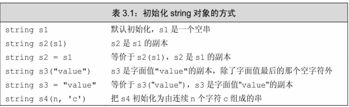
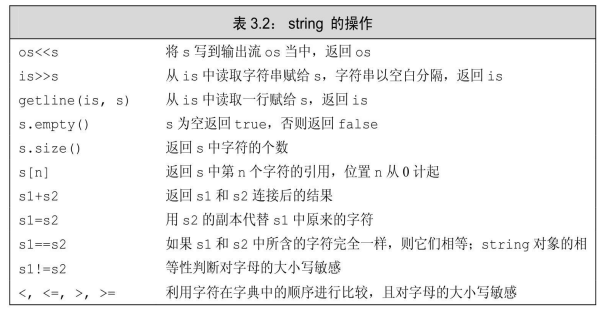
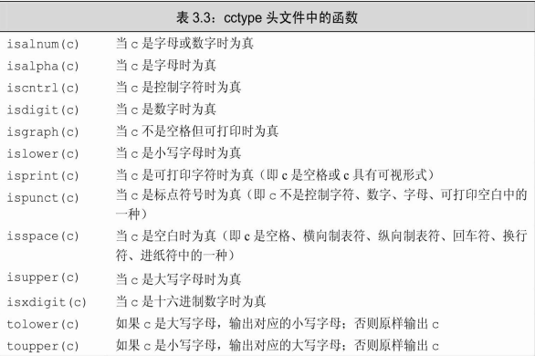
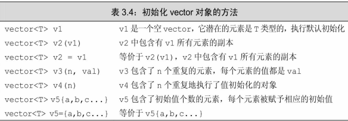
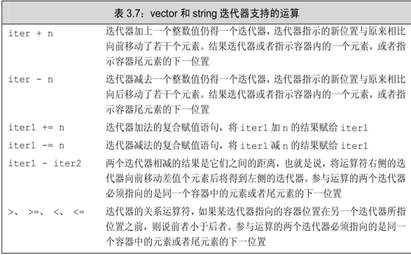

# Chapter 3  

本章将介绍两种最重要的标准库类型：string和vector。string表示可 变长的字符序列，vector存放的是某种给定类型对象的可变长序列 

## 3.1 命名空间的using声明

此处使用作用域操作符（`::`）的含义 是：编译器应从操作符左侧名字所示的作用域中寻找右侧那个名字。因 此，std：：cin的意思就是要使用命名空间std中的名字cin。 

通过更简单的途径也能 使用到命名空间中的成员。本节将学习其中一种最安全的方法，也就是 使用using声明（using declaration） 即使用

`using namespace::name;`

#### 每个名字都需要独立的using声明 

按照规定，每个using声明引入命名空间中的一个成员,C++语言的形 式比较自由，因此既可以一行只放一条using声明语句，也可以一行放上 多条。不过要注意，用到的每个名字都必须有自己的声明语句，而且每 句话都得以分号结束。 

```cpp
using std::cin;
using std::cout; using std::endl;
```

#### 头文件不应包含using声明 

一般来说不应该使用 using声明。这是因为头文件的内容会拷贝到所有引用它的文件中去，如 果头文件里有某个using声明，那么每个使用了该头文件的文件就都会有 这个声明 

## 3.2 标准类型string 

作为标准库的一部分，string定义在命名空间std中 

### 定义和初始化string对象



#### 直接初始化和拷贝初始化

如果使用等号（=）初始化一个变量，实际上执行的是**拷贝初始化（copy initialization）**，编译器把等号右侧的初始值拷贝到新 创建的对象中去。与之相反，如果不使用等号，则执行的是**直接初始化 （direct initialization）**，当初始值只有一个时，使用直接初始化或拷贝初始化都行。如果像 上面的s4那样初始化要用到的值有多个，一般来说只能使用直接初始化 的方式 

```cpp
string s5 = "hiya";
string s6("hiya");
string s7(10, 'c');  // 直接初始化 s7的内容是cccccccccc
```

### string对象上的操作



#### 读写对象

```cpp
int main(){
	string s;
	cin >> s;
	cout << s << endl;
	return 0;
}
```

这段程序首先定义一个名为s的空string，然后将标准输入的内容读 取到s中。在执行读取操作时，**string对象会自动忽略开头的空白**（即空 格符、换行符、制表符等）并从第一个真正的字符开始读起，直到遇见 下一处空白为止 

和内置类型的输入输出操作一样，string对象的此类操作也是返回 运算符左侧的运算对象作为其结果。因此，多个输入或者多个输出可以 连写在一起 

```cpp
string s1, s2;
cin >> s1 >> s2;
cout << s1 << s2;
```

#### 读取未知数量的string对象

```cpp
int main(){
    string word;
    while ( cin >> word ){
        cout << word << endl;
    }
    return 0;
}
```

#### 使用getline读取一整行

- getline函数的参数是一个输入 流和一个string对象，函数从给定的输入流中读入内容，直到遇到换行 符为止（注意换行符也被读进来了），然后把所读的内容存入到那个 string对象中去（注意不存换行符）；
- 和输入运算符一样，getline也会返回它的流参数。因此既然输入运 算符能作为判断的条件，我们也能用getline的 结果作为条件 

```cpp
int main(){
    string line;
    while ( getline(cin, line) )
        cout << line << endl;
    return 0;
}
```

#### string 的empty and size 操作

- empty函数根据string对象是否为空返回一个对应的布尔值 
- size函数返回string对象的长度（即string对象中字符的个数） 

#### string::size_type类型 

其实size函数返回的是 一个string::size_type类型的值 , string类及其他大多数标准库类型都定义了几种配套的类型。这些 配套类型体现了标准库类型与机器无关的特性，类型size_type即是其中的一种.能足够存放 下任何string对象的大小。所有用于存放string类的size函数返回值的变 量，都应该是string::size_type类型的 

#### 比较string对象

- 相等性运算符（==和！=）分别检验两个string对象相等或不相等， string对象相等意味着它们的长度相同而且所包含的字符也全都相同。 关系运算符<、<=、>、>=分别检验一个string对象是否小于、小于等 于、大于、大于等于另外一个string对象。上述这些运算符都依照（大 小写敏感的）字典顺序： 
  1. 如果两个string对象的长度不同，而且较短string对象的每个字符 都与较长string对象对应位置上的字符相同，就说较短string对象小于较 长string对象。 
  2. 如果两个string对象在某些对应的位置上不一致，则string对象比 较的结果其实是string对象中第一对相异字符比较的结果。 

#### 两个string对象相加

对string对象使用加法 运算符（+）的结果是一个新的string对象，它所包含的字符由两部分组 成：前半部分是加号左侧string对象所含的字符、后半部分是加号右侧 string对象所含的字符。另外，复合赋值运算符（+=）负责把右侧string对象的内容追加到左侧string对象的后面 :

```cpp
string s1 = "Hello, ", s2 = "world!\n";
string s3 = s1 + s2;
s1 += s2;
```

#### 字面值和string对象相加

当把string对象和字符字面值及字符串字面值混在一条语句中使用 时，必须确保每个加法运算符（+）的两侧的运算对象至少有一个是 string 

```cpp
string s4 = s1 + ", "; // ok: adding a string and a literal
string s5 = "hello" + ", "; // error: no string operand
string s6 = s1 + ", " + "world"; // ok: each + has a string operand
string s7 = "hello" + ", " + s2; // error: can't add string literals
```

##### 切记 

因为某些历史原因，也为了与C兼容，所以C++语言中的字符串字面值并不是标准库类型string的对象。切记，字符串字面值与string是不同的类型。 

### 处理string对象中的字符



- 一般来说，C++程序应该使用名为cname的头文件而不使用name.h的形式，标准库 中的名字总能在命名空间std中找到 

#### 处理每个字符？使用基于范围的for语句 

范围for（range for）语句。这 种语句遍历给定序列中的每个元素并对序列中的每个值执行某种操作， 其语法形式是 

```cpp
for (declaration : expression)
 statement
```

我们可以使用范围for 语句把string对象中的字符每行一个输出出来： 

```cpp
string str("some string");
// print the characters in str one character to a line
for (auto c : str) // for every char in str
 cout << c << endl; // print the current character followed by a newline
```

举个稍微复杂一点的例子，使用范围for语句和ispunct函数来统计 string对象中标点符号的个数 

```cpp
string s("Hello World!!!");
// punct_cnt has the same type that s.size returns; see § 2.5.3 (p. 70)
decltype(s.size()) punct_cnt = 0;
// count the number of punctuation characters in s
for (auto c : s) // for every char in s
 	if (ispunct(c)) // if the character is punctuation
 		++punct_cnt; // increment the punctuation counter
cout << punct_cnt
 	<< " punctuation characters in " << s << endl;
```

#### 使用范围for语句改变字符串中的字符 

如果想要改变string对象中字符的值，必须把循环变量定义成引用 类型。记住，所谓引用只是给定对象的一个别 名，因此当使用引用作为循环控制变量时，这个变量实际上被依次绑定 到了序列的每个元素上。使用这个引用，我们就能改变它绑定的字符 

假设我们想要把字符串改 写为大写字母的形式 

```cpp
string s("Hello World!");
for (auto &c : s)
    c = toupper(c);
cout << s << endl;
```

#### 只处理一部分字符 

- 下标运算符（[ ]）接收的输入参数是string::size_type类型的值 （参见3.2.2节，第79页），这个参数表示要访问的字符的位置；返回值 是该位置上字符的引用 
- string对象的下标从0计起。如果string对象s至少包含两个字符，则 s[0]是第1个字符、s[1]是第2个字符、s[s.size（）-1]是最后一个字符 

##### 警告

string对象的下标必须大于等于0而小于s.size()。 使用超出此范围的下标将引发不可预知的结果，以此推断，使用下标访问空 string也会引发不可预知的结果。 

## 3.3 标准库类型 vector

标准库类型vector表示对象的集合，其中所有对象的类型都相同。 C++语言既有类模板（class template），也有函数模板，其中vector 是一个类模板。 

模板本身不是类或函数，相反可以将模板看作为编译器生成类或函 数编写的一份说明。编译器根据模板创建类或函数的过程称为实例化 （instantiation），当使用模板时，需要指出编译器应把类或函数实例化 成何种类型.

对于类模板来说，我们通过提供一些额外信息来指定模板到底实例 化成什么样的类，需要提供哪些信息由模板决定。提供信息的方式总是 这样：即在模板名字后面跟一对尖括号，在括号内放上信息。 

### 定义和初始化vector对象



```cpp
vector<int> ivec; // initially empty
// give ivec some values
vector<int> ivec2(ivec); // copy elements of ivec into ivec2
vector<int> ivec3 = ivec; // copy elements of ivec into ivec3
vector<string> svec(ivec2); // error: svec holds strings, not ints
```

#### 列表初始化对象

C++11新标准还提供了另外一种为vector对象的元素赋初值的方 法，即列表初始化。此时，用花括号括起来的 0个或多个初始元素值被赋给vector对象： 

```cpp
vector<string> articles = {"a", "an", "the"}
```

上述vector对象包含三个元素：第一个是字符串"a"，第二个是字符 串"an"，最后一个是字符串"the"。 

C++语言提供了几种不同的初始化方式。在大多数情况下这些初始化方式可以相互等价地使用， 不过也并非一直如此。目前已经介绍过的两种例外情况是：

- 其一，使用 拷贝初始化时（即使用=时），只能提供一个 初始值；
- 其二，如果提供的是一个类内初始值，则只能使用拷贝初始化或使用花括号的形式初始化。
- 第三种特殊的要求是，如果提供的是初始元素值的列表，则只能把初始值都放在花 括号里进行列表初始化，而不能放在圆括号里： 

```cpp
vector<string> v1{"a", "an", "the"}; // list initialization
vector<string> v2("a", "an", "the"); // error
```

#### 创建指定数量的元素

还可以用vector对象容纳的元素数量和所有元素的统一初始值来初 始化vector对象 

```cpp
vector<int> ivec(10, -1); // ten int elements, each initialized to -1
vector<string> svec(10, "hi!"); // ten strings; each element is "hi!"
```

#### 值初始化

库会创建一个值初始化的（value-initialized）元素初值，并 把它赋给容器中的所有元素。这个初值由vector对象中元素的类型决 定。 

对这种初始化的方式有两个特殊限制：

- 其一，有些类要求必须明确 地提供初始值，如果vector对象中元素的类型 不支持默认初始化，我们就必须提供初始的元素值。对这种类型的对象 来说，只提供元素的数量而不设定初始值无法完成初始化工作。 
- 其二，如果只提供了元素的数量而没有设定初始值，只能使用直接 初始化： 

#### 列表初始值还是元素数量？ 

```cpp
vector<int> v1(10); // v1 has ten elements with value 0
vector<int> v2{10}; // v2 has one element with value 10
vector<int> v3(10, 1); // v3 has ten elements with value 1
vector<int> v4{10, 1}; // v4 has two elements with values 10 and 1
```

如果用的是**圆括号**，可以说提供的值是用来构造（construct）vector 对象的 ,如果用的是**花括号**，可以表述成我们想列表初始化（list initialize） 该vector对象 

### 向vector对象中添加元素

`push_back`负责把一个值当成vector对象的尾元素“压到 （push）”vector对象的“尾端（back）”。 

```cpp
vector<int> v2; // empty vector
for (int i = 0; i != 100; ++i)
 v2.push_back(i); // append sequential integers to v2
// at end of loop v2 has 100 elements, values 0 . . . 99
```

#### 向vector对象添加元素蕴含的编程假定 

如果循环体内部包含有向vector对象 添加元素的语句，则不能使用范围for循环， 

#### vector对象能高效增长

C++标准要求vector应该能在运行时高效快速地添加元素。因此既然vector对象能 高效地增长，那么在定义vector对象的时候设定其大小也就没什么必要了，事实上如果 这么做性能可能更差。只有一种例外情况，就是所有（all）元素的值都一样。一旦元 素的值有所不同，更有效的办法是先定义一个空的vector对象，再在运行时向其中添加 具体值。 

### 其他vector操作


```cpp
vector<int> v{1,2,3,4,5,6,7,8,9};
for (auto &i : v) // for each element in v (note: i is a reference)
 i *= i; // square the element value
for (auto i : v) // for each element in v
 cout << i << " "; // print the element
cout << endl;
```

size则返回vector对象中元素的个数，返回值的类型是由vector 定义的size_type类型 

**vector对象（以及string对象）的下标运算符可用于访问已存在的元素，而不能用 于添加元素。** 

## 3.4 迭代器介绍

迭代器也提供了对对象 的间接访问，迭代器有有效和无效之分，这一点和指针差不多。有效 的迭代器或者指向某个元素，或者指向容器中尾元素的下一位置；其他 所有情况都属于无效 

### 使用迭代器

获取迭代器不是使用取地址符，有迭代器的类 型同时拥有返回迭代器的成员。比如，这些类型都拥有名为begin和end 的成员，其中begin成员负责返回指向第一个元素（或第一个字符）的 迭代器。如有下述语句 

```cpp
// the compiler determines the type of b and e; see § 2.5.2 (p. 68)
// b denotes the first element and e denotes one past the last element in v
auto b = v.begin(), e = v.end(); // b and e have the same type
```

end成员则负责返回指向容器（或string对象）“尾元素的下一位置 （one past the end）”的迭代器.end 成员返回的迭代器常被称作尾后迭代器（off-the-end iterator）或者简称 为尾迭代器（end iterator）。特殊情况下如果容器为空，则begin和end 返回的是同一个迭代器。 

#### 迭代器运算表


#### 泛型编程

C++程序员习惯性地使 用！=，其原因和他们更愿意使用迭代器而非下标的原因一样：因为这种编程风格在标 准库提供的所有容器上都有效 

#### 迭代器类型

那些拥有迭代器的标准库类型使用iterator和 const_iterator来表示迭代器的类型 

```cpp
vector<int>::iterator it; // it can read and write vector<int> elements
string::iterator it2; // it2 can read and write characters in a string
vector<int>::const_iterator it3; // it3 can read but not write elements
string::const_iterator it4; // it4 can read but not writecharacters
```

const_iterator和常量指针差不多，能读取 但不能修改它所指的元素值。相反，iterator的对象可读可写。如果 vector对象或string对象是一个常量， 

#### begin和end运算符 

begin和end返回的具体类型由对象是否是常量决定，如果对象是常 量，begin和end返回const_iterator；如果对象不是常量，返回iterator： 

```cpp
vector<int> v;
const vector<int> cv;
auto it1 = v.begin(); // it1 has type vector<int>::iterator
auto it2 = cv.begin(); // it2 has type vector<int>::const_iterator
```

为了便于专门得到const_iterator类型的返回值， C++11新标准引入了两个新函数，分别是cbegin和cend 

```cpp
auto it3 = v.cbegin(); // it3 has type vector<int>::const_iterator
```

#### 结合解引用和成员访问操作 

解引用迭代器可获得迭代器所指的对象，如果该对象的类型恰好是 类，就有可能希望进一步访问它的成员。例如，对于一个由字符串组成 的vector对象来说，要想检查其元素是否为空，令it是该vector对象的迭 代器，只需检查it所指字符串是否为空就可以了 

```cpp
(*it).empty()
```

为了简化上述表达式，C++语言定义了箭头运算符（->）。箭头运 算符把解引用和成员访问两个操作结合在一起，也就是说，it->mem和 （＊it）.mem表达的意思相同 

#### 某些对vector对象的操作会使迭代器失效 

虽然vector对象可以动态地增长， 但是也会有一些副作用。已知的一个限制是不能在范围for循环中向 vector对象添加元素。另外一个限制是任何一种可能改变vector对象容量 的操作，比如push_back，都会使该vector对象的迭代器失效。 

**谨记，但凡是使用了迭代器的循环体，都不要向迭代器所属的容器添加元素。** 

### 迭代器运算



#### 迭代器的算术运算 

只要两个迭代器指向的是同一个容器中的元素或者尾元素的下一位 置，就能将其相减，所得结果是两个迭代器的距离。所谓距离指的是右 侧的迭代器向前移动多少位置就能追上左侧的迭代器，其类型是名为difference_type的带符号整型数。string和vector都定义了 difference_type，因为这个距离可正可负，所以**difference_type**是带符号 类型的 

#### 使用迭代器运算 

```cpp
// text must be sorted
// beg and end will denote the range we're searching
auto beg = text.begin(), end = text.end();
auto mid = text.begin() + (end - beg)/2; // original midpoint
// while there are still elements to look at and we haven't yet found sought
while (mid != end && *mid != sought) {
 	if (sought < *mid) // is the element we want in the first half?
 		end = mid; // if so, adjust the range to ignore the secondhalf
 	else // the element we want is in the second half
 		beg = mid + 1; // start looking with the element just after mid
 	mid = beg + (end - beg)/2; // new midpoint
}
```

