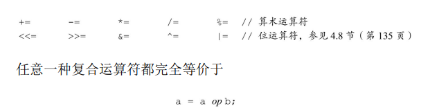
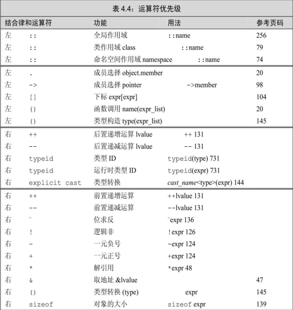

## Chapter 4

表达式由一个或多个运算对象（**operand**）组成，对表达式求值将 得到一个结果（**result**）。字面值和变量是最简单的表达式 （**expression**），其结果就是字面值和变量的值。把一个运算符 （**operator**）和一个或多个运算对象组合起来可以生成较复杂的表达 式。 

### 4.1 基础

#### 基本概念

C++定义了一元运算符（unary operator）和二元运算符（binary operator）。作用于一个运算对象的运算符是一元运算符，如取地址符 （&）和解引用符（*）；作用于两个运算对象的运算符是二元运算 符，如相等运算符（==）和乘法运算符（*）。除此之外，还有一个作 用于三个运算对象的三元运算符。函数调用也是一种特殊的运算符，它 对运算对象的数量没有限制 

##### 组合运算符和运算对象

首先要 理解运算符的优先级（**precedence**）、结合律（**associativity**）以及运算 对象的求值顺序（order of evaluation）。 

##### 重载运算符

C++语言定义了运算符作用于内置类型和复合类型的运算对象时所 执行的操作，称之为重载运算符（overloaded operator）。

##### 左值和右值

C++的表达式要不然是右值（rvalue，读作“are-value”），要不然就 是左值（lvalue，读作“ell-value”）。 一个左值表达式的求 值结果是一个对象或者一个函数，然而以常量对象为代表的某些左值实 际上不能作为赋值语句的左侧运算对象。 

**当一个 对象被用作右值的时候，用的是对象的值（内容）；当对象被用作左值 的时候，用的是对象的身份（在内存中的位置）** 

###### 一个重要的原则 

是在需要右值的地方可以用左值来代替，但是不能把右值当成左值（也就是位置）使用。

- 赋值运算符需要一个（非常量）左值作为其左侧运算对象，得到 的结果也仍然是一个左值。 
- 取地址符作用于一个左值运算对象，返 回一个指向该运算对象的指针，这个指针是一个右值。
- 内置解引用运算符、下标运算符、迭代器解引用运算符、string和vector的下标运算符的求值结果都是左值。 · 
- 内置类型和迭代器的递增递减运算符作用于左值运算对象，其前置版本所得的结果也是左值。 

使用关键字`decltype`的时候，左值和右值 也有所不同。如果表达式的求值结果是左值，decltype作用于该表达式得到一个引用类型。 

#### 优先级与结合律

复合表达式（compound expression）是指含有两个或多个运算符的 表达式 

高优先 级运算符的运算对象要比低优先级运算符的运算对象更为紧密地组合在 一起。如果优先级相同，则其组合规则由结合律确定。 算术运算符 满足左结合律，意味着如果运算符的优先级相同，将按照从左向右的顺 序组合运算对象 

-  根据运算符的优先级，表达式3+4＊5的值是23，不是35 
- 根据运算符的结合律，表达式20-15-3的值是2，不是8。

##### 括号无视优先级和结合率

括号无视普通的组合规则，表达式中括号括起来的部分被当成一个 单元来求值，然后再与其他部分一起按照优先级组合。

#### 求值顺序

- 对于那些没有指定执行顺序的运算符来说，如果表达式指向并修改 了同一个对象，将会引发错误并产生未定义的行为 

##### 求值顺序、优先级、结合律

运算对象的求值顺序与优先级和结合律无关，在一条形如f（） +g（）＊h（）+j（）的表达式中 

- 优先级规定，g（）的返回值和h（）的返回值相乘。 
- 结合律规定，f（）的返回值先与g（）和h（）的乘积相加，所得 结果再与j（）的返回值相加 
- 对于这些函数的调用顺序没有明确规定。 

如果f、g、h和j是无关函数，它们既不会改变同一对象的状态也不 执行IO任务，那么函数的调用顺序不受限制。反之，如果其中某几个函 数影响同一对象，则它是一条错误的表达式，将产生未定义的行为。 

##### 建议：处理复合表达式 

- .拿不准的时候最好用括号来强制让表达式的组合关系符合程序逻辑的要求。 
- 如果改变了某个运算对象的值，在表达式的其他地方不要再使用这个运算对 象。 但是有例外比如 (`*++iter`)

### 4.2 算数运算符


当作用于算术类型的对象时，算术运算符+、-、＊、/的含义分别是 加法、减法、乘法和除法。整数相除结果还是整数，也就是说，如果商 含有小数部分，直接弃除 

```
int ival1 = 21/6; 	// ival 是 3 结果进行了删节
int ivall = 21/7;	// ival 是 3
```

在除法运算中，如果两个运算对象的符号相同则商为正（如果不为 0的话），否则商为负。C++语言的早期版本允许结果为负值的商向上 或向下取整，C++11新标准则**规定商一律向0取整（即直接切除小数部 分）** 

如果m和n是整数且n非0，则表达式（m/n） ＊n+m%n的求值结果与m相等。隐含的意思是，如果m%n不等于0，则 它的符号和m相同。C++语言的早期版本允许m%n的符号匹配n的符号， 而且商向负无穷一侧取整，这一方式在新标准中已经被禁止使用了。除 了-m导致溢出的特殊情况，其他时候（-m）/n和m/（-n）都等于- （m/n），m%（-n）等于m%n，（-m）%n等于-（m%n）。 

### 4.3 逻辑和关系运算符

逻辑运算符和关系运算符的返回值都是布尔类 型。值为0的运算对象（算术类型或指针类型）表示假，否则表示真。 对于这两类运算符来说，运算对象和求值结果都是右值。 

##### 逻辑和逻辑或运算符

逻辑与运算符和逻辑或运算符都是先求左侧运算对象的值再求右侧 运算对象的值，当且仅当左侧运算对象无法确定表达式的结果时才会计 算右侧运算对象的值。这种策略称为短路求值（short-circuit evaluation） 

- 对于逻辑与运算符来说，当且仅当左侧运算对象为真时才对右侧 运算对象求值。 
- 对于逻辑或运算符来说，当且仅当左侧运算对象为假时才对右侧 运算对象求值 

##### 逻辑非运算符

逻辑非运算符（!）将运算对象的值取反后返回

##### 相等性测试和布尔字面值

进行比较运算时除非比较的对象是布尔类型，否则不要使用布尔字面值true和false 作为运算对象。 

### 4.4 赋值运算符

赋值运算符的左侧运算对象必须是一个可修改的左值。 C++11新标准允许使用花括号括起来的初始值列表作为赋值语句的右侧运算对象。

如果左侧运算对象是内置类型，那么初始值列表最多只能包含一个 值，而且该值即使转换的话其所占空间也不应该大于目标类型的空间 

对于类类型来说，赋值运算的细节由类本身决定。对于vector来 说，vector模板重载了赋值运算符并且可以接收初始值列表，当赋值发 生时用右侧运算对象的元素替换左侧运算对象的元素 

#####  赋值运算满足右结合律 

赋值运算符满足右结合律，这一点与其他二元运算符不太一样： 

```cpp
int ival, jval;
ival = jval = 0;
```

因为赋值运算符满足右结合律，所以靠右的赋值运算jval=0作为靠 左的赋值运算符的右侧运算对象 

##### 赋值运算优先级低

赋值语句经常会出现在条件当中。因为赋值运算的优先级相对较 低，所以通常需要给赋值部分加上括号使其符合我们的原意。 

```cpp
int i ;
while ( ( i = get_value() != 42 ) ) {
    //其他处理
}
```

本例想法：不断循环读取 数据直至遇到42为止。其处理过程是首先将get_value函数的返回值赋给 i，然后比较i和42是否相等

-  因为赋值运算符的优先级低于关系运算符的优先级，所以在条件语句中，赋值部 分通常应该加上括号。 

##### 复合赋值运算符

每种运算符都有相 应的复合赋值形式



### 4.5 递增和递减运算符

递增和递减运算符有两种形式：前置版本和后置版本。到目前为 止，本书使用的都是前置版本，这种形式的运算符首先将运算对象加 1（或减1），然后将改变后的对象作为求值结果。后置版本也会将运算 对象加1（或减1），但是求值结果是运算对象改变之前那个值的副本；

这两种运算符必须作用于左值运算对象。**前置版本将对象本身作为 左值返回，后置版本则将对象原始值的副本作为右值返回。** 

##### 建议

对于整数和指针类型来说，编译器可能对这种额外的工作进行一定的优化；但是 对于相对复杂的迭代器类型，这种额外的工作就消耗巨大了。建议养成使用前置版本 的习惯，这样不仅不需要担心性能的问题，而且更重要的是写出的代码会更符合编程 的初衷。 

##### 在一条语句中混用解引用和递增运算符

```cpp
auto pbeg = v.begin();
while (pbeg != v.end() && *beg >= 0)
	cout << *pbeg++ << endl;
```

**后置递增运算符的优先级高于解引用运算符**，因此＊pbeg++等价于 ＊（pbeg++）。pbeg++把pbeg的值加1，然后返回pbeg的初始值的副本 作为其求值结果，此时解引用运算符的运算对象是pbeg未增加之前的 值。最终，这条语句输出pbeg开始时指向的那个元素，并将指针向前移 动一个位置。 

这种用法完全是基于一个事实，即后置递增运算符返回初始的未加 1的值。如果返回的是加1之后的值，解引用该值将产生错误的结果。不 但无法输出第一个元素，而且更糟糕的是如果序列中没有负值，程序将 可能试图解引用一个根本不存在的元素 

### 4.6 成员访问运算符

点运算符获取类对象的一个成员；箭 头运算符与点运算符有关，表达式`ptr->mem`等价于`(*ptr).mem `因为解引用运算符的优先级低于点运算符，所以执行解引用运算的 子表达式两端必须加上括号。 

### 4.7 条件运算符

条件运算符（？ ：）允许我们把简单的if-else逻辑嵌入到单个表达 式当中，条件运算符按照如下形式使用： 

```cpp
cond ? expr1 : expr2;
```

其中cond是判断条件的表达式，而expr1和expr2是两个类型相同或 可能转换为某个公共类型的表达式。条件运算符的执行过程是：首先 求cond的值，如果条件为真对expr1求值并返回该值，否则对expr2求值 并返回该值。 

##### 嵌套条件运算符

允许在条件运算符的内部嵌套另外一个条件运算符 

```cpp
finalgrade = (grade > 90)? "high pass"
							: (grade < 60)? "fail" : "pass"
```

随着条件运算嵌套层数的增加，代码的可读性急剧下降。因此，条件运算的嵌套 最好别超过两到三层。 

##### 在输出表达式中使用条件运算符

条件运算符的优先级非常低，因此当一条长表达式中嵌套了条件运 算子表达式时，通常需要在它两端加上括号。 

### 4.8 位运算符


左移运算符（<<）在右侧插入值为0的二进制位。右移运算符 （>>）的行为则依赖于其左侧运算对象的类型：如果该运算对象是无符 号类型，在左侧插入值为0的二进制位；如果该运算对象是带符号类 型，在左侧插入符号位的副本或值为0的二进制位，如何选择要视具体 环境而定。 

##### 位求反运算符

位求反运算符（~）将运算对象逐位求反后生成一个新值，将1置为 0、将0置为1： 

##### 位于、位或、位异或运算符

对于位与运算符（&）来说，如果两个运算对象的对应位置都是1 则运算结果中该位为1，否则为0。对于位或运算符（|）来说，如果两 个运算对象的对应位置至少有一个为1则运算结果中该位为1，否则为 0。对于位异或运算符（^）来说，如果两个运算对象的对应位置有且只 有一个为1则运算结果中该位为1，否则为0。 

### 4.9 sizeof运算符

sizeof运算符返回一条表达式或一个类型名字所占的字节数。sizeof 运算符满足右结合律，其所得的值是一个size_t类型的常量表达式，并且**sizeof并不实际计算其运算对象的值** 

```cpp
sizeof (*p)
```

因为sizeof满足右结 合律并且与＊运算符的优先级一样，所以表达式按照从右向左的顺序组 合。也就是说，它等价于sizeof（＊p）。其次，因为sizeof不会实际求 运算对象的值，所以即使p是一个无效（即未初始化）的指针也不会有什么影响。在sizeof的运算对象中解引用一 个无效指针仍然是一种安全的行为，因为指针实际上并没有被真正使 用。**sizeof不需要真的解引用指针也能知道它所指对象的类型** 

sizeof运算符的结果部分地依赖于其作用的类型：

- 对char或者类型为char的表达式执行sizeof运算，结果得1。 
- 对引用类型执行sizeof运算得到被引用对象所占空间的大小。 
- 对指针执行sizeof运算得到指针本身所占空间的大小。 
- 对解引用指针执行sizeof运算得到指针指向的对象所占空间的大 小，指针不需有效。
- 对数组执行sizeof运算得到整个数组所占空间的大小，等价于对数 组中所有的元素各执行一次sizeof运算并将所得结果求和。注意，sizeof 运算不会把数组转换成指针来处理。 
- 对string对象或vector对象执行sizeof运算只返回该类型固定部分的 大小，不会计算对象中的元素占用了多少空间。

因为执行sizeof运算能得到整个数组的大小，所以可以用数组的大 小除以单个元素的大小得到数组中元素的个数

```cpp
constexpr size_t sz = sizeof(ia) / sizeof(*ia);
int arr2[sz];
```

因为sizeof的返回值是一个常量表达式，所以我们可以用sizeof的结 果声明数组的维度 

### 4.10逗号运算符

- 逗号运算符（comma operator）含有两个运算对象，按照从左向右 的顺序依次求值。和逻辑与、逻辑或以及条件运算符一样，逗号运算符 也规定了运算对象求值的顺序。

- 对于逗号运算符来说，首先对左侧的表达式求值，然后将求值结果 丢弃掉。逗号运算符真正的结果是右侧表达式的值。如果右侧运算对象 是左值，那么最终的求值结果也是左值 

### 4.11 类型转换

加法的两个运算对象类型不同，C++语言不会直接将两个不同类型的值相加，而是先根据类型转换 规则设法将运算对象的类型统一后再求值。 它们被称作**隐式转换（implicit conversion）**。 

算术类型之间的隐式转换被设计得尽可能避免损失精度。很多时 候，如果表达式中既有整数类型的运算对象也有浮点数类型的运算对 象，整型会转换成浮点型 

##### 何时发生隐式转换

- 在大多数表达式中，比int类型小的整型值首先提升为较大的整数 类型。 
- 在条件中，非布尔值转换成布尔类型。 
- 初始化过程中，初始值转换成变量的类型；在赋值语句中，右侧 运算对象转换成左侧运算对象的类型。 
- 如果算术运算或关系运算的运算对象有多种类型，需要转换成同 一种类型。
- 函数调用时也会发生类型转换。 

#### 算数转换

算术转换（arithmetic conversion）的含义是把一种算术类型转换成 另外一种算术类型

##### 整型提升

整型提升（integral promotion）负责把小整数类型转换成较大的整 数类型 

较大的char类型（wchar_t、char16_t、char32_t）提升成int、 unsigned int、long、unsigned long、long long和unsigned long long中最小 的一种类型，前提是转换后的类型要能容纳原类型所有可能的值。 

##### 无符号类型的运算对象

- 如果一个运算对象是无符号类型、另外一个运算对象是带符号类 型，而且其中的无符号类型不小于带符号类型，那么带符号的运算对象 转换成无符号的 。
- 带符号类型大于无符号类型，此时转换的结果依 赖于机器。如果无符号类型的所有值都能存在该带符号类型中，则无符 号类型的运算对象转换成带符号类型。如果不能，那么带符号类型的运 算对象转换成无符号类型。 

#### 其他隐式类型转换

- 数组转换成指针：在大多数用到数组的表达式中，数组自动转换成 指向数组首元素的指针：

```cpp
int ia[100];
int *p = ia;
```

- 指针的转换：C++还规定了几种其他的指针转换方式，包括常量整 数值0或者字面值nullptr能转换成任意指针类型；指向任意非常量的指针 能转换成void＊；指向任意对象的指针能转换成const void＊。 
- 转换成布尔类型：存在一种从算术类型或指针类型向布尔类型自动 转换的机制。如果指针或算术类型的值为0，转换结果是false；否则转 换结果是true 
- 转换成常量：允许将指向非常量类型的指针转换成指向相应的常量 类型的指针，对于引用也是这样 
- 类类型定义的转换：类类型能定义由编译器自动执行的转换，不过 编译器每次只能执行一种类类型的转换。 

#### 显示转换

有时我们希望显式地将对象强制转换成另外一种类型 就要使用某种方法 即强制类型转换 (cast)

一个命名的强制类型转换具有如下形式：

```cpp
cast-name<type>(expression)
```

其中，type是转换的目标类型而expression是要转换的值。如果type 是引用类型，则结果是左值。cast-name 是static_cast、dynamic_cast、const_cast和reinterpret_cast中的一种.

##### static_cast

任何具有明确定义的类型转换，只要不包含底层const，都可以使用 static_cast。 

当需要把一个较大的算术类型赋值给较小的类型时，static_cast非常 有用。此时，强制类型转换告诉程序的读者和编译器：我们知道并且不 在乎潜在的精度损失。一般来说，如果编译器发现一个较大的算术类型 试图赋值给较小的类型，就会给出警告信息；但是当我们执行了显式的 类型转换后，警告信息就会被关闭了。 

##### const_cast

const_cast只能改变运算对象的底层const,对于将常量对象转换成非常量对象的行为，我们一般称其为“**去掉 const性质（cast away the const）**” 

只有const_cast能改变表达式的常量属性，使用其他形式的命名强制 类型转换改变表达式的常量属性都将引发编译器错误。 

##### reinterpret_cast

reinterpret_cast本质上依赖于机器。要想安全地使用reinterpret_cast必须对涉及的类 型和编译器实现转换的过程都非常了解 ,容易出错。

### 4.12 运算符优先级表




